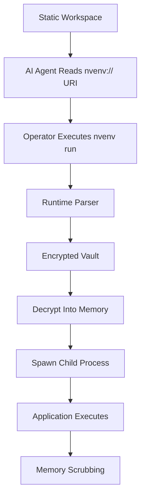

# The nvenv Protocol Specification

**Protocol Version:** 1.0
**Specification Version:** 1.0.0
**Reference Implementation:** nvenv CLI v2.0.7
**Status:** Stable
**Author:** Sarvesh Sonkusre
**Release Date:** July 2026

---

## Table of Contents

1. [Abstract & Introduction](#1-abstract--introduction)
    - 1.1 Vulnerability Paradigm
    - 1.2 Core Thesis
    - 1.3 Strategic Directives
2. [The `nvenv://` URI Specification](#2-the-nvenv-uri-specification)
    - 2.1 Formal ABNF Grammar
    - 2.2 Structural Components
    - 2.3 Deployment Examples
3. [Compliant Runtime Engine Requirements](#3-compliant-runtime-engine-requirements)
    - 3.1 Memory Isolation Architecture
    - 3.2 Cryptographic Storage Specifications
    - 3.3 Distribution Model
4. [Process Execution Lifecycle](#4-process-execution-lifecycle)
5. [Recursion Control & Infinite Loop Mitigation](#5-recursion-control--infinite-loop-mitigation)
6. [System Failure Modes](#6-system-failure-modes)

# Terminology

The key words **MUST**, **MUST NOT**, **REQUIRED**, **SHALL**, **SHALL NOT**, **SHOULD**, **SHOULD NOT**, **RECOMMENDED**, **NOT RECOMMENDED**, **MAY**, and **OPTIONAL** in this document are to be interpreted as described in RFC 2119.

---

# 1. ABSTRACT & INTRODUCTION

## 1.1 Vulnerability Paradigm

Modern autonomous AI agents, LLM-powered developer assistants, IDE extensions, and automated code interpreters require deep access to local project workspaces to perform complex lifecycle tasks (e.g., code generation, semantic debugging, automated testing, dependency analysis, and deployment).

The contemporary secrets management ecosystem relies heavily on static environment variables and plaintext configuration files, including:

- `.env` / `.env.local` files
- Shell exports (`export KEY=value`)
- CI/CD pipeline environment blocks
- Plaintext application settings files

Because these mechanisms expose sensitive credentials to any execution layer capable of reading the file system or inheriting the process environment, they introduce severe security vectors:

- **Permanent Credential Exfiltration:** Malicious or compromised dependencies reading `process.env` or local files and shipping secrets to third-party endpoints.
- **Prompt Context Leakage:** Sensitive tokens inadvertently pulled into LLM context windows during broad workspace indexing or codebase embedding generation.
- **AI Memory Contamination:** Long-term caching or logging of unredacted credentials within an AI provider's internal state or fine-tuning datasets.
- **Supply Chain Harvesting:** Automated dependency resolution scripts intercepting secrets during build phases.
- **Recursive Autonomous API Abuse:** Agents autonomously exhausting rate limits or calling paid APIs recursively due to unchecked access to live platform tokens.
- **Accidental Source Control Commits:** Unauthorized tracking of local dot-files containing production secrets to public repositories.

The fundamental weakness is that secrets exist as plaintext **before** execution begins.

---

## 1.2 Core Thesis

The **$nvenv$ Protocol** replaces static secret exposure with **Just-In-Time (JIT) Runtime Proxy Injection**.

Instead of storing plaintext credentials, applications reference semantic resource identifiers using the `nvenv://` scheme.

Example:

```env
OPENAI_API_KEY=nvenv://openai_main
DATABASE_URL=nvenv://production/postgres
```

At runtime:

1. The execution engine locates every `nvenv://` reference.
2. Secrets are securely resolved from an encrypted vault.
3. Decryption occurs only inside a protected runtime boundary.
4. Secrets are injected directly into the child process memory.
5. Memory is scrubbed immediately after process termination.

Throughout the development lifecycle, AI agents, editors, source control systems, and build tools interact only with opaque identifiers instead of plaintext credentials.

---

## 1.3 Strategic Directives

## Security Goals

The protocol is designed to achieve the following objectives:

- Eliminate plaintext secret storage.
- Minimize credential lifetime.
- Preserve application compatibility.
- Prevent accidental credential disclosure.
- Reduce AI-assisted credential exposure.
- Enable centralized policy enforcement.

### Context Blindness

Plaintext secrets MUST NEVER appear inside:

- workspace files
- source repositories
- environment configuration
- editor buffers
- AI prompt context
- terminal history

---

### Just-In-Time Resolution

Secrets MUST be resolved only at the lowest practical execution boundary immediately before process execution or standard input consumption.

---

### Zero-Knowledge Runtime

Plaintext credentials MUST NEVER be written to:

- disk
- cache files
- build artifacts
- crash dumps
- stdout
- stderr
- log files
- temporary storage

---

> [!IMPORTANT]
> A compliant implementation MUST assume every external tool—including AI agents, IDE extensions, and build utilities—is untrusted unless explicitly authorized.

---

# 2. THE `nvenv://` URI SPECIFICATION & GRAMMAR

The `$nvenv$` Protocol introduces a deterministic URI scheme used to represent protected secret references.

Instead of embedding credentials directly, applications store opaque resource identifiers.

---

## 2.1 Formal ABNF Grammar

```abnf
nvenv-uri      = "nvenv://" authority path

authority      = [ vault-scope ]

path           = "/" secret-alias

vault-scope    = 1*( ALPHA / DIGIT / "_" / "-" / "." )

secret-alias   = 1*( ALPHA / DIGIT / "_" / "-" / "." )
```

### Reserved Characters

The following characters are reserved and MUST NOT appear unescaped within a secret alias:

```
:
?
#
%
&
=
@
```

Future protocol revisions MAY define semantics for reserved characters.

---

## 2.2 Structural Components

| Component | Required | Description |
|------------|----------|-------------|
| `nvenv://` | Yes | Protocol identifier |
| Vault Scope | Optional | Logical vault partition |
| Secret Alias | Yes | Unique identifier inside the vault |

---

### Protocol Identifier

The protocol prefix

```
nvenv://
```

signals that the value MUST NOT be treated as plaintext.

Instead, the runtime engine routes the request through the secret resolution pipeline.

---

### Vault Scope

The vault scope identifies a logical storage namespace.

Examples:

```
production
development
personal
workspace
```

Example:

```
DATABASE_URL=nvenv://production/postgres
```

---

### Secret Alias

The secret alias uniquely identifies an encrypted credential.

Example:

```
openai_main
postgres
aws_root
github_pat
```

Aliases are case-sensitive.

---

## 2.3 Deployment Examples

A compliant `.env` file SHOULD resemble:

```env
OPENAI_API_KEY=nvenv://openai_main

DATABASE_URL=nvenv://production/postgres

AWS_SECRET_ACCESS_KEY=nvenv://aws/account01

STRIPE_SECRET_KEY=nvenv://payments/stripe_live
```

Notice that no plaintext credentials exist.

---

# 3. COMPLIANT RUNTIME ENGINE REQUIREMENTS

A compliant implementation MUST satisfy the following execution guarantees.

---

## 3.1 Memory Isolation Architecture

### 1. Child Process Execution

Applications MUST execute through an isolated child process.

Example:

```bash
nvenv run node server.js
```

The parent shell MUST remain free of decrypted credentials.

---

### 2. Runtime Injection

The runtime engine MUST:

1. Parse configuration files.
2. Resolve every `nvenv://` reference.
3. Decrypt secrets.
4. Inject them directly into the child process environment.

Secrets MUST NOT be exported globally.

---

### 3. Anti-Spillage Protection

Implementations MUST NOT write plaintext secrets into:

- swap files
- temp folders
- shell history
- build outputs
- editor backups
- crash reports

---

### 4. Memory Scrubbing

Implementations SHOULD securely erase plaintext buffers where the implementation language and operating system permit deterministic memory management.

Languages without deterministic memory control MAY rely on native runtime components responsible for secure buffer handling.

Example pseudocode:

```text
Process Exit
      │
      ▼
Overwrite Secret Buffer
      │
      ▼
Release Memory
      │
      ▼
Terminate Process
```

---

## 3.2 Cryptographic Storage Specifications

### Storage Location

The encrypted vault SHOULD reside in:

```
~/.nvenv/vault.db
```

The protocol does not mandate a fixed storage path.

Implementations SHOULD store encrypted vault data inside an operating-system-appropriate user data directory.

Examples:

| Platform | Example |
|----------|---------|
| Windows | `%LOCALAPPDATA%\nvenv\vault.db` |
| macOS | `~/Library/Application Support/nvenv/vault.db` |
| Linux | `~/.local/share/nvenv/vault.db` |

---

### Encryption

Implementations MUST use an authenticated encryption algorithm (AEAD).

Recommended algorithms include:

- AES-256-GCM
- ChaCha20-Poly1305

Future protocol revisions MAY approve additional AEAD algorithms.

---

### Key Derivation

Encryption keys MUST NOT be hardcoded.

Instead, implementations MUST derive or protect keys using the host operating system.

| Platform | Secure Storage |
|-----------|----------------|
| Windows | DPAPI / Credential Manager |
| macOS | Keychain Services |
| Linux | Libsecret / Secret Service |

> [!IMPORTANT]
> Falling back to plaintext master keys is NOT permitted.

---

## 3.3 Reference Implementation Architecture

The protocol supports multiple language ecosystems while maintaining a single native runtime implementation.

```
npm
 │
 ├──────────────┐
 │              │
 ▼              ▼

pip          cargo
 │              │
 └──────┬───────┘
        ▼

Native Binary

        ▼

Runtime Engine
```

Language-specific packages SHOULD behave as lightweight launchers.

The native runtime performs:

- vault access
- secret resolution
- injection
- proxy execution
- cleanup

This ensures consistent behavior across ecosystems.

---

# 4. PROCESS EXECUTION LIFECYCLE (THE JIT PIPELINE)



## Phase 1 — Static Evaluation

The AI agent scans the project workspace.

Example:

```env
OPENAI_API_KEY=nvenv://openai_main
```

The agent observes only an opaque URI.

No credential material is exposed.

---

## Phase 2 — Runtime Initialization

The operator launches:

```bash
nvenv run python app.py
```

The runtime:

- loads configuration
- parses `nvenv://` references
- authenticates against the operating system
- unlocks the encrypted vault

---

## Phase 3 — Secret Resolution

Each URI is resolved.

```
nvenv://production/postgres
```

↓

```
Encrypted Vault
```

↓

```
Decrypted Buffer
```

↓

```
Child Process Environment
```

Plaintext secrets exist only during execution.

---

# 5. RECURSION CONTROL & INFINITE LOOP MITIGATION

Autonomous AI agents may enter recursive execution loops that repeatedly invoke the same application, resulting in excessive API consumption, unexpected infrastructure costs, or denial-of-service conditions.

While the `$nvenv$` Protocol primarily focuses on protecting secrets, compliant implementations SHOULD provide optional safeguards against uncontrolled execution behavior.

---

## 5.1 Threat Model

Example failure scenario:

```
AI Agent
    │
    ▼
Runs Application
    │
    ▼
Application Calls OpenAI API
    │
    ▼
Receives Error
    │
    ▼
AI Attempts Automatic Fix
    │
    ▼
Runs Again
    │
    ▼
Repeats Hundreds of Times
```

Potential consequences include:

- Excessive API billing
- Infinite execution loops
- Resource exhaustion
- Accidental denial-of-service
- Secret abuse through repeated authentication

---

## 5.2 Session-Based Injection Limits

Implementations MAY maintain an in-memory execution session that tracks secret resolutions.

Each successful resolution increments an internal counter.

```
OPENAI_API_KEY

↓

Resolution #1

↓

Resolution #2

↓

Resolution #3
```

The counter MUST exist only for the lifetime of the execution session.

---

## 5.3 Maximum Resolution Threshold

The runtime MAY expose a configurable execution limit.

Example:

```bash
nvenv run --max-calls 100 node app.js
```

Behavior:

1. Session starts.
2. Counter initialized to zero.
3. Each successful resolution increments the counter.
4. Threshold reached.
5. Further resolutions are denied.
6. Process exits with a non-zero exit code.

Example output:

```text
ERROR: Maximum secret resolution limit exceeded.

Configured Limit : 100

Current Count    : 101

Execution terminated.
```

---

## 5.4 Optional Rate Limiting

Implementations MAY additionally enforce:

- requests per second
- requests per minute
- maximum concurrent resolutions
- idle timeout
- session timeout

These controls reduce abuse without affecting legitimate workloads.

---

## 5.5 Future Extensions

Future protocol revisions MAY support:

- Organization-wide quotas
- User-specific quotas
- Policy-driven execution budgets
- AI workload classification
- Billing integration
- Adaptive throttling

---

# 6. SYSTEM FAILURE MODES & EXPECTED BEHAVIORS

Security software MUST fail safely.

Whenever an unrecoverable condition occurs, the implementation MUST deny secret access rather than attempting insecure fallback behavior.

---

## 6.1 Failure Principles

Compliant implementations MUST satisfy the following:

- Fail Closed
- Never reveal plaintext secrets
- Produce deterministic errors
- Preserve vault integrity
- Avoid partial execution

---

## 6.2 Failure Mode Matrix

| Failure Event | Threat Model | Required Response |
|---------------|--------------|-------------------|
| Missing Vault Entry | Secret alias not found | Abort execution immediately. |
| Vault Corruption | Database cannot be decrypted | Exit with failure. Do not continue. |
| Keychain Access Denied | Operating system rejects access | Prompt user authorization and terminate. |
| Invalid URI | Malformed `nvenv://` identifier | Reject configuration before execution. |
| Signature Verification Failure | Policy signature invalid | Reject policy and continue using the last trusted version (if available) or fail closed. |
| Secret Leakage Detection | Plaintext appears in output | Replace matching values with `[REDACTED_BY_nvenv]`. |
| Memory Allocation Failure | Secure buffer unavailable | Abort execution immediately. |

---

## 6.3 Missing Vault Entry

Example:

```env
OPENAI_API_KEY=nvenv://production/openai_live
```

If the alias does not exist:

```text
ERROR

Requested secret could not be resolved.

Alias unavailable.

Execution aborted.
```

The application MUST NOT start.

---

## 6.4 Operating System Authorization Failure

If the operating system refuses access to the encryption key:

```
Windows DPAPI

↓

Access Denied

↓

Abort Execution
```

Fallback mechanisms are prohibited.

The runtime MUST NOT:

- request plaintext passwords
- create temporary master keys
- disable encryption

---

## 6.5 Vault Corruption

If vault integrity verification fails:

```
Encrypted Vault

↓

Authentication Tag Failure

↓

Vault Rejected

↓

Abort
```

No recovery attempt should expose decrypted data.

---

## 6.6 Runtime Secret Leakage

Applications may accidentally print secrets.

Example:

```text
OPENAI_API_KEY=sk-live-xxxxxxxxxxxxxxxx
```

The runtime SHOULD intercept output streams and redact known plaintext values.

Example:

```text
OPENAI_API_KEY=[REDACTED_BY_nvenv]
```

---

## 6.7 Invalid URI

Example:

```env
OPENAI_API_KEY=nvenv:/incorrect
```

or

```env
DATABASE_URL=nvenv://
```

The parser MUST reject malformed identifiers before execution begins.

---

# 7. SECURITY CONSIDERATIONS

The `$nvenv$` Protocol is designed to reduce credential exposure, not eliminate all security risks.

Implementations SHOULD consider additional operating system and application-level protections.

---

## 7.1 Threats In Scope

The protocol directly mitigates:

- Plaintext `.env` exposure
- AI prompt leakage
- Repository credential commits
- IDE indexing
- Dependency scanning
- Environment variable harvesting
- Static configuration theft

---

## 7.2 Threats Out of Scope

The protocol does **not** protect against:

- Privileged kernel malware
- Hardware keyloggers
- Memory inspection by privileged administrators
- Compromised operating systems
- Physical device compromise
- Malicious applications executing inside the trusted child process

These threats require additional operating system or hardware security controls.

---

## 7.3 Principle of Least Exposure

Implementations SHOULD expose plaintext secrets:

- only when required
- only inside trusted execution boundaries
- only for the minimum lifetime necessary

---

## 7.4 Memory Lifetime

Secrets SHOULD remain resident in memory only for the duration of process execution.

Example lifecycle:

```
Decrypt

↓

Inject

↓

Use

↓

Overwrite

↓

Release
```

---

## 7.5 Logging Requirements

Implementations MUST NOT log:

- plaintext secrets
- decrypted payloads
- encryption keys
- authentication material

Safe logging examples include:

- vault alias
- timestamp
- process identifier
- execution duration
- policy identifier

---

# Compliance Classes

## Minimal Compliance

Supports:

- URI parsing
- Vault lookup
- Runtime injection

## Standard Compliance

Additionally supports:

- Output redaction
- Memory cleanup
- Native keychain integration

## Enterprise Compliance

Additionally supports:

- Signed policies
- Audit logging
- Device trust
- Centralized policy distribution

An implementation claiming compliance with the `$nvenv$` Protocol MUST satisfy every mandatory requirement described in this specification.

---

## 8.1 Mandatory Requirements

A compliant implementation MUST:

- Support the `nvenv://` URI scheme.
- Resolve secrets only at runtime.
- Store credentials using authenticated encryption.
- Protect encryption keys using native operating system facilities.
- Execute applications as isolated child processes.
- Prevent plaintext persistence.
- Reject malformed URIs.
- Fail closed during unrecoverable errors.
- Prevent insecure fallback behavior.

---

## 8.2 Recommended Features

Implementations SHOULD provide:

- Output redaction
- Memory scrubbing
- Secret caching controls
- Audit logging
- Session limits
- Runtime policies
- Organization-wide policy support

---

## 8.3 Optional Features

Implementations MAY support:

- Remote vault synchronization
- Enterprise policy distribution
- Hardware security modules
- Trusted execution environments
- Cloud-based control planes
- Multi-user vaults
- Plugin architectures


# Protocol Compatibility

Implementations MUST reject incompatible protocol revisions.

Backward-compatible revisions SHOULD preserve URI syntax.

Future protocol versions MAY introduce additional URI components while maintaining compatibility with Version 1.x implementations.

---


# 9. FUTURE EXTENSIONS

Future revisions of the protocol may introduce standardized support for:

- Database credential injection
- SSH key mediation
- Kubernetes secret resolution
- OCI container runtime integration
- Browser credential mediation
- AI execution policy enforcement
- Organization-wide governance
- Cryptographically signed policy bundles
- Secret rotation APIs
- Remote attestation

Future extensions SHOULD remain backward compatible whenever possible.

---

# 10. REFERENCES

- RFC 2119 — Key words for use in RFCs to Indicate Requirement Levels
- RFC 3986 — Uniform Resource Identifier (URI): Generic Syntax
- NIST SP 800-57 — Recommendation for Key Management
- NIST SP 800-63 — Digital Identity Guidelines
- AES-GCM (NIST)
- ChaCha20-Poly1305 (RFC 8439)

---

# Appendix A — Example Configuration

```env
OPENAI_API_KEY=nvenv://openai_main

DATABASE_URL=nvenv://production/postgres

AWS_ACCESS_KEY_ID=nvenv://aws/access_key

AWS_SECRET_ACCESS_KEY=nvenv://aws/secret_key

STRIPE_SECRET_KEY=nvenv://payments/stripe_live
```

---

# Appendix B — Example Execution

```bash
nvenv run node server.js
```

Execution flow:

```
Load Configuration
        │
        ▼
Parse nvenv:// References
        │
        ▼
Unlock Vault
        │
        ▼
Resolve Secrets
        │
        ▼
Inject Child Environment
        │
        ▼
Execute Application
        │
        ▼
Scrub Memory
        │
        ▼
Exit
```

---

# Copyright

Copyright © 2026 Sarvesh Sonkusre.

This document defines Version **1.0.0-RC1** of the **$nvenv$ Protocol Specification**.

Future revisions SHOULD preserve backward compatibility where practical while maintaining the security guarantees defined by this specification.
