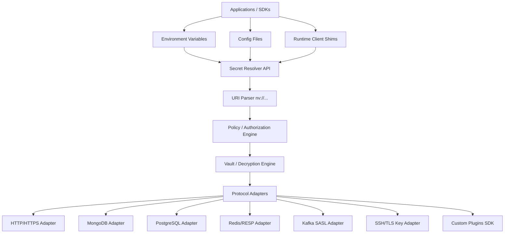

# 🔒 Universal Secret Virtualization Layer (USVL) Specification & Roadmap

This document outlines the vision, architecture, and roadmap for transitioning **nv-protocol** (`nvenv`) from an HTTP-centric cryptographic proxy into a **Universal Secret Virtualization Layer (USVL)**.

---

## 1. The Vision: Secrets Are Transport-Agnostic

Traditionally, secrets have been treated as environment variables or HTTP headers. However, HTTP is just one of many transports where secrets are exchanged. A truly secure architecture must virtualize secrets across **all** execution planes and communication protocols, keeping the human operator and autonomous AI agents mathematically blind to the underlying credentials.

By implementing the USVL, `nvenv` ensures that:
1. Applications, SDKs, and scripts refer to credentials exclusively using **cryptographic URIs** (`nv://...`).
2. Plaintext secrets never land on disk, shell history, environment variables, or process listings.
3. Secrets are resolved **lazily and in volatile memory** only at the exact millisecond and interface boundary (socket, memory pointer, custom API) where they are consumed.

---

## 2. The Secret Universe: Taxonomy & Coverage

| Category | Examples | Interception Vector | Support Status |
| :--- | :--- | :--- | :--- |
| **HTTP APIs** | OpenAI, Stripe, GitHub REST | Outbound HTTP/S Request | ✅ Fully Supported |
| **Git / VCS** | GitHub PAT, GitLab Token | Git Credential Helper | ✅ Fully Supported |
| **Database Auth** | MongoDB, PostgreSQL, MySQL, Redis | Client connection string | ⚠️ Planned (Via Shims) |
| **Message Brokers** | Kafka, RabbitMQ | SASL Handshake / Connection | ❌ Planned |
| **Cloud Credentials** | AWS, Azure, GCP | SDK auth/Metadata request | ❌ Planned |
| **Shell & Files** | SSH Keys, SSL Client Certs | Key files, SSH Agent | ❌ Planned |
| **Orchestration** | Kubeconfig, Docker Registry | Config file parser | ❌ Planned |
| **Security Tokens** | JWT keys, Signing Keys | Crypto operations (ECDSA/RSA) | ❌ Planned |
| **Browser Automation**| Session Cookies (Playwright) | Cookie jar storage | ❌ Planned |

---

## 3. The Four Planes of Secret Exposure

Credentials leak into the environment in four distinct ways. The virtualization layer operates across all of them:

```
┌────────────────────────────────────────────────────────┐
│                   Application Runtime                  │
└───────────────────────────┬────────────────────────────┘
                            │
       ┌────────────────────┼────────────────────┐
       ▼                    ▼                    ▼
┌──────────────┐    ┌──────────────┐    ┌────────────────┐
│ Environment  │    │ Configuration│    │ Runtime        │
│  Variables   │    │    Files     │    │ Authentication │
└──────┬───────┘    └──────┬───────┘    └────────┬───────┘
       │                   │                     │
       └───────────────────┼─────────────────────┘
                           │
                           ▼
               ┌───────────────────────┐
               │   Network Protocols   │
               └───────────────────────┘
```

1.  **Environment Variables**: Traditional injects like `OPENAI_API_KEY=sk-...`. Supported by `nvenv` today by leaving environment variables empty of plaintext and relying on proxy-level substitution.
2.  **Configuration Files**: Config files (`config.json`, `settings.yaml`, `.kube/config`) containing raw secrets. Virtualized by scanning/injecting values during file read or pre-processing.
3.  **Runtime Authentication**: Programmatic APIs like `MongoClient("mongodb://...")` or `redis.connect()`. Virtualized using client-side runtime shims/monkeypatching.
4.  **Network Protocols**: Protocol-specific TCP frames (HTTP, MongoDB wire protocol, SMTP, LDAP). Virtualized at the network socket layer.

---

## 4. Universal Hierarchical Secret URI Specification

Instead of a flat structure (`nv://KEY`), the USVL introduces a hierarchical URI schema to support multi-provider, multi-environment, and vault-routed configuration formats:

```text
nv://[vault-context/][provider]/[object-path]
```

### Examples in Use:
*   **Simple Local Key**: `nv://openai/api-key` (Resolves to default local vault OpenAI secret)
*   **Database Credentials**: `nv://postgres/main`
*   **Team/Shared Vaults**: `nv://vault/team-backend/postgres`
*   **Hierarchical Paths**: `nv://production/aws/root` or `nv://staging/stripe/live`

This schema enables granular access control policies. For example, a policy in `~/.nv/config.json` can allow a process access to `nv://staging/*` but deny access to `nv://production/*`.

---

## 5. Evolved Long-Term Plugin Architecture

To scale support across dozens of database engines, cloud SDKs, and transport protocols without bloat, `nvenv` implements a decoupled, adapter-based system:



---

## 6. Implementation Blueprint: Runtime Shimming (Phase 1 Databases)

Runtime shimming hooks database client constructors at startup, replacing `nv://` URIs with decrypted values inside the process virtual memory *immediately* before establishing the TCP connection.

### Python Database Shims (`py_wrapper/shims.py`)
```python
import sys
import re
from vault import Vault

_vault = Vault()

def decrypt_string(val: str) -> str:
    """Helper to swap nv:// URIs with decrypted vault values."""
    if not isinstance(val, str):
        return val
    return re.sub(r'nv://([A-Za-z0-9_/\-]+)', lambda m: _vault.get(m.group(1)) or m.group(0), val)

def apply_shims():
    # 1. MongoDB (pymongo)
    try:
        import pymongo
        original_init = pymongo.MongoClient.__init__
        def shimmed_mongo_init(self, *args, **kwargs):
            new_args = list(args)
            if len(new_args) > 0 and isinstance(new_args[0], str):
                new_args[0] = decrypt_string(new_args[0])
            if "host" in kwargs and isinstance(kwargs["host"], str):
                kwargs["host"] = decrypt_string(kwargs["host"])
            original_init(self, *new_args, **kwargs)
        pymongo.MongoClient.__init__ = shimmed_mongo_init
    except ImportError:
        pass

    # 2. PostgreSQL (psycopg2)
    try:
        import psycopg2
        original_connect = psycopg2.connect
        def shimmed_pg_connect(*args, **kwargs):
            new_args = list(args)
            if len(new_args) > 0 and isinstance(new_args[0], str):
                new_args[0] = decrypt_string(new_args[0])
            for k in ("dsn", "password", "host"):
                if k in kwargs and isinstance(kwargs[k], str):
                    kwargs[k] = decrypt_string(kwargs[k])
            return original_connect(*new_args, **kwargs)
        psycopg2.connect = shimmed_pg_connect
    except ImportError:
        pass

    # 3. Redis (redis-py)
    try:
        import redis
        original_from_url = redis.ConnectionPool.from_url
        redis.ConnectionPool.from_url = lambda url, *a, **kw: original_from_url(decrypt_string(url), *a, **kw)
    except ImportError:
        pass

apply_shims()
```

### Node.js Database Shims (`py_wrapper/node_shim.js`)
```javascript
const Module = require('module');
const { execSync } = require('child_process');

function decryptString(val) {
  if (typeof val !== 'string') return val;
  return val.replace(/nv:\/\/([A-Za-z0-9_/\-]+)/g, (match, key) => {
    try {
      return execSync(`nvenv get ${key} --silent`, { encoding: 'utf8' }).trim();
    } catch {
      return match;
    }
  });
}

const originalLoad = Module._load;
Module._load = function (request) {
  const exports = originalLoad.apply(this, arguments);

  // 1. MongoDB Intercept
  if (request === 'mongodb') {
    const originalConnect = exports.MongoClient.prototype.connect;
    exports.MongoClient.prototype.connect = function () {
      if (this.s && this.s.url) this.s.url = decryptString(this.s.url);
      return originalConnect.apply(this, arguments);
    };
  }

  // 2. PostgreSQL Intercept
  if (request === 'pg') {
    const originalClientConnect = exports.Client.prototype.connect;
    exports.Client.prototype.connect = function () {
      if (this.connectionParameters) {
        if (this.connectionParameters.password) {
          this.connectionParameters.password = decryptString(this.connectionParameters.password);
        }
      }
      return originalClientConnect.apply(this, arguments);
    };
  }

  return exports;
};
```

---

## 7. Evolutionary Roadmap

To deliver maximum developer and agentic alignment, implementation is divided into strategic phases:

*   **Phase 1: DB Connection Strings**
    *   Targets: MongoDB, PostgreSQL, MySQL, Redis.
    *   Method: Runtime language-specific shimming (Python & Node.js).
*   **Phase 2: Cloud Provider SDKs**
    *   Targets: AWS credentials, GCP service accounts, Azure client secrets.
    *   Method: Environment and config file dynamic virtualization.
*   **Phase 3: File-Based Interception**
    *   Targets: SSH private keys (`~/.ssh/id_rsa`), TLS certificates (`client.pem`), Kubeconfig (`~/.kube/config`).
    *   Method: Custom preloader file hooks / Ephemeral virtual mount adapter.
*   **Phase 4: Token Exchange & Identifiers**
    *   Targets: JWT signing keys, OAuth lifecycle tokens.
    *   Method: Crypto shims.
*   **Phase 5: Extensible Plugin SDK**
    *   Allow developer communities to publish custom protocol/SDK adapters.
