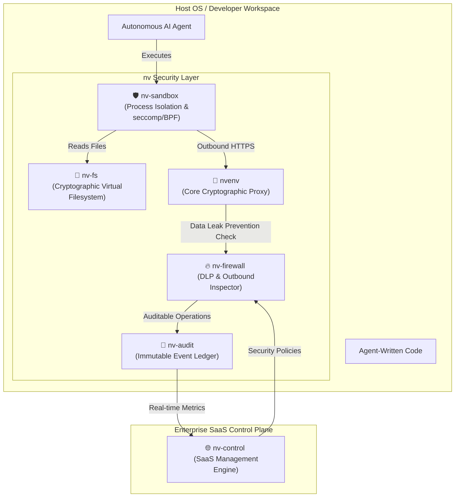

# 🚀 Startup Blueprint: The `nv` AI-Agent Security Ecosystem

## 1. Executive Summary & Market Opportunity

As autonomous AI software engineers (e.g., Cursor, Claude Code, Devin, Windsurf) gain write-access to filesystems, command lines, and production servers, they introduce a massive new category of security vulnerabilities:
1.  **Exfiltration via Telemetry/Prompts:** AI agents reading credentials from `.env` files and outputting them in debug logs, error messages, or prompt histories, leaking them to LLM providers.
2.  **Prompt Injection Exploits:** Malicious third-party code or data (e.g., in a git repository or database) instructing the AI agent to steal keys, execute commands, or send private data to external endpoints.
3.  **Unbounded Authority:** AI agents running arbitrary shell scripts that scrap local SSH keys, read personal system configurations, or scan internal local networks.

The current enterprise security stack (IAM, Firewalls, DLP) is blind to **agentic behaviors**. 

**The Solution:** An interconnected **Zero-Trust AI Agent Security Layer** that decouples real-world credentials, filesystems, network connections, and system privileges from the viewable context of the AI. The AI remains mathematically blind to the underlying assets while applications execute normally.

---

## 2. The Interconnected Ecosystem Architecture



---

## 3. Product Blueprints

### I. `nvenv` (The Core Network-Boundary Secret Proxy)
*   **Purpose:** Decouples secrets from process environment variables and source code.
*   **How it Works:** Replaces raw tokens with secure URI placeholders (`nv://STRIPE_KEY`). Intercepts outbound TLS handshakes in volatile memory at the OS socket boundary, substituting the real key dynamically.
*   **Startup Evolution:** Grow this from a CLI tool to a universal system daemon that automatically intercepts requests across Docker, Kubernetes, and local environments without wrapper execution.

### II. `nv-fs` (Cryptographic Virtual Filesystem)
*   **Purpose:** Restricts AI agents from reading sensitive local files (e.g., SSH keys, databases, configuration files, source code folders) while allowing the code they write to execute them.
*   **How it Works:**
    *   Creates a virtual filesystem mount (via FUSE or system file system filter drivers).
    *   When the **AI Agent's PID** tries to read a file, `nv-fs` intercepts the call and serves a placeholder or hashed representation.
    *   When an **authorized runtime process** (e.g., Python, Node, Git) tries to read the file, `nv-fs` dynamically streams the real bytes from the vault.
*   **Value:** Prevents prompt-injected agents from scraping the host filesystem for SSH credentials or database secrets.

### III. `nv-sandbox` (Context-Isolated Execution Sandbox)
*   **Purpose:** Safely executes code generated or written by AI agents.
*   **How it Works:**
    *   Wraps command executions in a hypervisor-level or containerized microVM (using Firecracker or gVisor).
    *   Utilizes eBPF (Extended Berkeley Packet Filter) to trace every system call made by agent-spawned subprocesses.
    *   Ensures that file modifications, process forks, and raw sockets are strictly constrained to whitelist behaviors.
*   **Value:** Safely test AI code changes locally without risking a system wipe or malicious code execution.

### IV. `nv-firewall` (Agentic Application Firewall & DLP)
*   **Purpose:** Inspects all outgoing data streams for data exfiltration patterns.
*   **How it Works:**
    *   Acts as the exit gateway for `nvenv`.
    *   Uses regex, entropy detection, and custom deep learning models to identify exfiltration behavior (such as bulk database rows, private key formats, or base64-encoded file payloads).
    *   If a threat is identified (e.g., the agent tries to POST `~/.gitconfig` contents to an external domain), it immediately suspends the network frame and raises a system-level notification prompting the human for confirmation.
*   **Value:** Stops the AI from stealing source code or personal data.

### V. `nv-audit` (Tamper-Proof Audit Ledger)
*   **Purpose:** Maintains a forensic audit trail of all actions taken by AI agents.
*   **How it Works:**
    *   Logs every CLI command, file read/write, injected secret, network destination, and process fork.
    *   Saves logs to a local append-only file signed cryptographically with a machine-bound private key, forwarding it to a centralized cloud ledger.
*   **Value:** Compliance, debugging, and insurance against damage caused by autonomous agents.

### VI. `nv-control` (Central Enterprise SaaS Control Plane)
*   **Purpose:** Central management plane for security policies, auditing, and keys across developer teams.
*   **How it Works:**
    *   Admin dashboard showing all active agent developer setups.
    *   Allows teams to centrally specify rules (e.g., "AI agents are not allowed to access Stripe secrets in production code branches" or "Rate limit OpenAI secret calls to 10/min").
    *   Generates compliance scorecards for SOC2/ISO27001 mapping AI security controls.

---

## 4. End-to-End Enterprise Developer Workflow

Let's walk through how a developer uses the complete `nv` ecosystem to run an AI coding agent:

1.  **Initialization:** The developer starts the daemon:
    ```bash
    nv start
    ```
    This mounts `nv-fs` on the project directory, spins up the background `nvenv` socket proxy, and initiates `nv-audit`.
2.  **Coding:** The AI Agent is asked to integrate Stripe checkout.
    *   The agent edits `.env` but can only write `STRIPE_API_KEY=nv://STRIPE_API_KEY`.
    *   The agent attempts to read `~/.ssh/id_rsa` to verify git configuration; `nv-fs` intercepts the system call and returns a mock file: `[Encrypted Vault Identifier]`.
3.  **Testing Code:** The AI agent executes:
    ```bash
    nvenv run -- npm run dev
    ```
    *   `nv-sandbox` intercepts this, isolating the server inside an ephemeral, non-privileged namespace.
    *   When the server calls `https://api.stripe.com`, `nvenv` substitutes `nv://STRIPE_API_KEY` with the real key inside volatile memory at the TLS socket handshake.
    *   `nv-firewall` checks the request body to ensure no source code is attached, validating it against the local policy config.
4.  **Logging:** `nv-audit` signs the command execution, source PID, target host, and outcome, sending it to the enterprise's central `nv-control` dashboard.

---

## 5. Startup Roadmap & Go-To-Market (GTM) Strategy

### Phase 1: Open-Source Validation (Months 0–6)
*   **Goal:** Establish developer trust and adoption of the free core CLI.
*   **GTM:** Distribute `nvenv` as a zero-dependency open-source utility. Build wrappers for Cursor and Claude Code. Focus marketing on "Zero-Trust AI Coding".

### Phase 2: Local Desktop Platform (Months 6–12)
*   **Goal:** Deliver the first premium desktop version.
*   **Product:** Launch the local daemon integrating `nv-fs` (VFS) and `nv-firewall` (local exfiltration filter).
*   **Monetization:** Individual developer subscription ($10/month) for advanced local features and automatic credential sync.

### Phase 3: Central Enterprise Cloud Controls (Months 12–24)
*   **Goal:** Capture the B2B team segment.
*   **Product:** Release `nv-control` SaaS, targeting Engineering Directors and Security Officers.
*   **Value Proposition:** "SOC2 compliance for AI developers, central key revocation, and agent security event tracing."
*   **Monetization:** Enterprise licensing ($30/developer/month) + auditing ledger storage fees.
